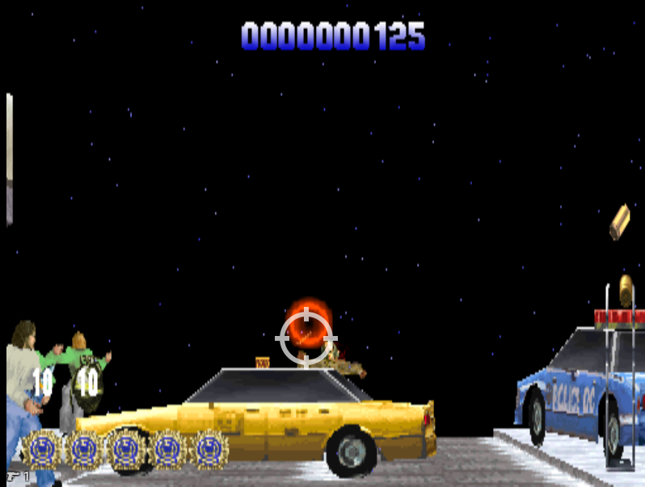

# Die Hard Trilogy PSX Light Gun and UI fixes

Separate PPF patches for the **Die Hard 2** portion of Die Hard Trilogy on
PlayStation: setup-specific lightgun aiming corrections and a smaller HUD.

## UI preview



The UI patch makes the score and counters smaller, moves the rocket/grenade
counters to the bottom left, corrects the health badge proportions, and removes
the controller-mode symbol.

## Downloads

- [Gun Patch Mister.ppf](patches/Gun%20Patch%20Mister.ppf) — X −13, Y +6
  (left/down); candidate awaiting MiSTer hardware testing.
- [Gun Patch Emulator.ppf](patches/Gun%20Patch%20Emulator.ppf) — X −13, Y −6
  (left/up); tested and accepted in DuckStation.
- [Die Hard 2 UI Patch.ppf](patches/Die%20Hard%202%20UI%20Patch.ppf) — corrected
  health badge proportions, smaller rocket/grenade counters at bottom left,
  smaller score centered near the top, and no controller-mode icon.

Use **one** aiming patch, optionally together with the UI patch. The UI patch
also works alone. Do not combine the two aiming profiles.

## Supported base image

**Die Hard Trilogy (USA) (v1.1), SLUS-00119**, with the existing
**Nuvee USA Greatest Hits GunCon conversion already applied**.
https://emulationrealm.net/downloads/plugins/playstation/input/nuvee

Apply to `Die Hard Trilogy (USA) (v1.1) (Track 01).bin`, not the CUE or CHD.
These patches do not install the original GunCon conversion and do not target
an unmodified game image or other regions/revisions.

Expected Track 01 SHA-256:

```text
1a2f348289285ad95cbaed49ffb535cc0d3792307a9a7d6c66fa6c486cdef3a1
```

Make a copy of the supported BIN and apply the chosen PPFs with a
PPF3-compatible patcher. UI and aiming patches can be applied in either order.
Keep the other tracks and CUE together. Boot the game fresh after patching:
old savestates can restore the previous code in RAM. Normal memory-card saves
can still be used. For CHD use, patch the BIN before rebuilding the CHD.

[Full application and undo instructions](patches/README.md).

## Status

The emulator aiming correction and UI changes were tested live in DuckStation
and accepted by the tester. The MiSTer offset is based on the latest illustrated
impact position and **has not yet been hardware-tested**. These are fixed
offsets for the tested/reported setups, not an in-game calibration menu.

All PPFs include undo data and regenerated sector EDC/ECC. The builder checks
application, executable bytes, checksums, undo, and UI/aiming combinations in
both orders. [Verification manifest](patches/Verification.json).

## Rebuilding

Python 3.11 or newer, standard library only:

```sh
python tools/build_patches.py "/path/to/Die Hard Trilogy (USA) (v1.1) (Track 01).bin"
```

The builder requires the exact source hash above, opens the source read-only,
and writes generated PPFs and a verification manifest to `build/`. The game
image is supplied locally by the user; it is not included in this repository.

Implementation:

- `tools/badge_renderer.py`: replacement HUD helper within the existing code
  footprint; the health-strip caller uses a 32 × 19 textured quad.
- `tools/hud_layout.py`: counter/score size and position edits.
- `tools/build_patches.py`: aiming profiles, mode-icon suppression, PPF writer,
  application/undo checks, and combination checks.
- `tools/disc_image.py` and `tools/sector_ecc.py`: raw disc reading and sector
  checksum generation.

## References

This work builds on the existing
[Nuvee GunCon conversion](https://github.com/mirror/nuvee/tree/master/ps1%20-%20guncon%20conversions/Die%20Hard%20Trilogy).
PPF3 encoding follows the original
[MakePPF3 source](https://github.com/Sappharad/MultiPatch/blob/master/ppfdev/makeppf3_linux.c).
